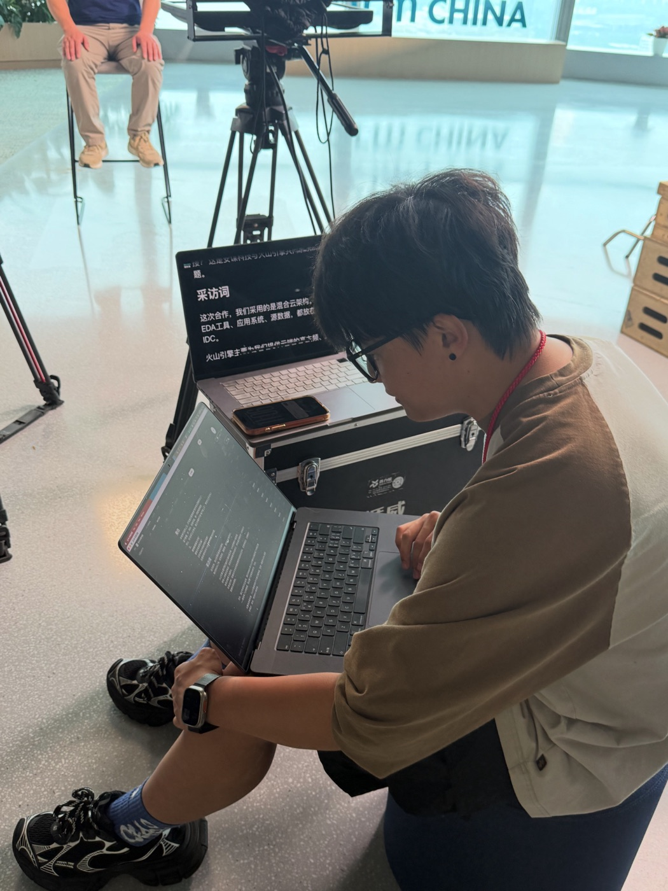

# 庄Sir的提词器

为真实拍摄现场准备的本地提词器。

[访问官网](https://zhuang-prompter-web.vercel.app) · [下载 Mac（Apple Silicon）](https://bill-api.whatonearth.work/prompter/download/macos-arm64) · [下载 Mac（Intel）](https://bill-api.whatonearth.work/prompter/download/macos-x64) · [下载 Windows x64](https://bill-api.whatonearth.work/prompter/download/windows-x64) · [下载 Windows ARM64](https://bill-api.whatonearth.work/prompter/download/windows-arm64)

当前发行版 **v0.1.12**。这一版修复了 **Intel(x64) Mac 与 ARM64 Windows** 安装包安装后启动失败（打开后点功能无反应、约 30 秒弹出「本机服务未能及时启动 / The local server did not start in time」）——根因是这两个平台交叉构建时打入了错误架构的原生库；**Apple Silicon Mac 与 x64 Windows 不受影响**。0.1.11 的这两个平台安装包受影响,请升级到 0.1.12。功能不变：macOS 同时覆盖 Apple Silicon 与 Intel(x64) 两种架构，Windows（x64 / ARM64）不变。Mac 打开下载的 DMG 拖入「应用程序」安装，Windows 支持 App 内自动更新；文稿与房间数据始终留在本机。网站部署在 Vercel，安装包与更新源独立存放在下载服务器。

它不是一个简单的“滚动文字网页”，而是一套可以直接上现场的提词工作台：一台电脑负责写稿、改稿和控制播放，另一块屏幕、另一台电脑、iPad 或手机负责给出镜者显示清爽的大字提词画面。

<p align="center">
  
  
</p>

<p align="center">
  <sub>真实拍摄现场：控制端写稿、改稿、控稿；播放端给出镜者稳定显示大字提词。</sub>
</p>

## 为什么做它

真实拍摄里，最麻烦的往往不是“把文字滚起来”，而是这些时刻：

- 嘉宾已经坐好了，现场还在改词
- 长稿录到一半，需要快速跳回某个重录点
- 提词器镜像方向不对，临开拍还在调
- 出镜者只想看干净的大字，控制端却需要看到备注、标记和版本
- 文稿不方便上传到陌生云端，只想留在自己的电脑里

庄Sir的提词器就是为这种场景做的。

## 它适合谁

- 视频创作者：口播、知识视频、产品讲解、课程录制
- 小型拍摄团队：一个人控稿，一个人出镜
- 访谈和客户证言拍摄：现场可改、可跳段、可重来
- 不想上传脚本的团队：文稿默认保存在本机

## 现场怎么用

1. 在控制端创建一个房间。
2. 直接写稿、粘贴 Markdown、添加标记点和备注。
3. 播放端在浏览器打开好记短链 `play.local:3000`，输入房间号（或扫控制端二维码）加入同一个房间。
4. 控制端负责播放、暂停、调速、跳段、镜像和全屏。
5. 出镜者只看清爽大字，不被后台信息打扰。

一个房间就是一个拍摄项目。不同视频、课程、访谈和直播，都可以分别保存。

## 核心能力

### 控制端

- 友好的 Markdown 文稿编辑
- 渲染视图里直接改稿
- 添加标记点，用于章节、重录点、重点段落跳转
- 添加备注，用于看镜头、停顿、语气、镜头和后期提示
- 保存版本和本地项目
- 控制播放端播放、暂停、回到开头、跳到结尾
- 控制播放速度、字号、水平镜像、垂直镜像
- 好记短链一键复制 + 二维码邀请，方便局域网内设备加入

### 播放端

- 大字号提词画面
- 自动滚动
- 全屏显示
- 水平镜像和垂直镜像
- 默认隐藏标记点，让出镜者只专注读词
- 可设为主播放端，多个播放端时同步更稳定

### 本地优先

当前版本不要求登录账号，不依赖云端数据库。文稿和房间数据默认保存在你的电脑上。

这意味着：

- 不上传未发布脚本
- 没有外网也能在局域网内使用
- 用 Mac 开热点，两台设备连接同一网络即可工作
- 更适合拍摄现场的临时、快速、稳定使用

## 下载

前往 Release 页面下载最新版：

[下载庄Sir的提词器](https://github.com/billzhuang6569/zhuang-prompter/releases)

当前推荐：

- macOS Apple Silicon：下载 `.dmg`，打开后拖入「应用程序」
- macOS Intel：下载 Intel 版 `.dmg`，打开后拖入「应用程序」
- Windows x64 / ARM64：下载 `.exe` 安装包，之后可在 App 内自动更新

> 当前是早期公开版本，安装包还没有商业代码签名。首次打开时，macOS 或 Windows 可能会提示“未知开发者”，这是未签名软件的常见提示。

## 局域网使用

控制端和播放端需要在同一个网络里。

例如：

- 同一个 Wi-Fi
- 同一个手机热点
- 同一个办公室局域网

控制端会给出一个好记短链，同一局域网内的设备直接用它进入：

```text
play.local:3000
```

在播放端浏览器打开这个地址、输入房间号即可加入；也可以扫控制端显示的二维码。若个别设备无法解析 `play.local`，控制端会同时给出基于当前 IP 的备用网址。

如果播放端打不开，通常检查三件事：

- 两台设备是否在同一个网络
- 能否解析 `play.local`（不行就改用控制端给的 IP 备用网址）
- 控制端电脑防火墙是否允许局域网访问

更详细说明见：[本地网络使用说明](docs/local-network-usage.md)

## 当前版本

v0.1.12 已在真实拍摄现场使用。已覆盖 macOS（Apple Silicon / Intel）与 Windows（x64 / ARM64）：Windows 支持 App 内自动更新，Mac 打开 DMG 拖入安装。本版修复了 Intel Mac 与 ARM64 Windows 交叉构建包的启动失败问题。

它仍在快速迭代，后续会继续优化：

- 语音辅助滚动
- 安装包代码签名
- 更稳定的多播放端同步
- 更适合团队使用的项目管理

如果你在现场使用中遇到问题，欢迎提交反馈：

[GitHub Issues](https://github.com/billzhuang6569/zhuang-prompter/issues)

## 开源

庄Sir的提词器是一个开源项目。

你可以免费下载、使用、研究和参与改进它。这个项目会优先围绕真实拍摄现场继续打磨，而不是做成一个复杂臃肿的通用文档工具。
